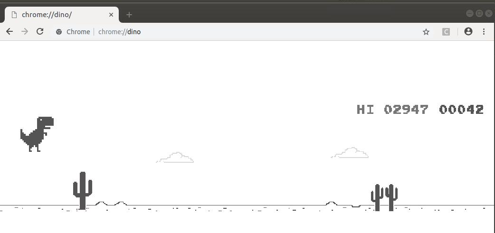

# Chrome Dino player based on Q-learning
## Features
- Dino has running for over 10 hours

## Run
1. Please run `init_cache()` **once**.
2. You need change the path of the Chrome driver in the file `game.py` according to the system platform. (I think i need regarded it as a parameter)
## Dependenices
1. Python 3.6 Environment with ML libraries installed (numpy,pandas,keras,tensorflow etc)
2. Selenium
3. OpenCV
## Reference
1. [Paperspace/DinoRunTutorial](https://github.com/Paperspace/DinoRunTutorial)
2. [Build an AI to play Dino Run](https://blog.paperspace.com/dino-run/)